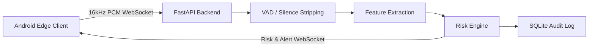

# VoiceGuard 
**Real-Time Voice Authenticity & Deepfake Risk Intelligence**

> **SIH 2026 | AICTE Cyber Security Cell**

VoiceGuard is an advanced, localized threat-intelligence platform designed to detect synthetic speech, cloned voices, and social engineering fraud in real-time. By bridging a lightweight Android edge client with a robust Python/FastAPI localhost backend, VoiceGuard evaluates the authenticity of incoming audio streams before critical trust is breached.

---

## ◈ SYSTEM OVERVIEW

As voice synthesis (TTS) and Retrieval-based Voice Conversion (RVC) technologies become increasingly accessible, traditional caller verification methods are obsolete. VoiceGuard provides a layered signal-processing and machine-learning defense system to instantly calculate the synthetic probability of an active speaker.

### Core Value Proposition
- **Real-Time Analysis**: Stream audio from an Android device to a local PC backend via WebSocket for immediate risk scoring.
- **Privacy First**: Audio is analyzed locally on your hardware. **Raw audio is never stored.**
- **Edge-to-Localhost Architecture**: The Android client operates purely as a capture and UI transport layer, offloading intensive ML feature extraction to the backend PC.

---

## ◈ FEATURE INTELLIGENCE MATRIX

| Capability | Status | Description |
|---|---|---|
| **Live Monitor** | Implemented | Real-time microphone capture and analysis via WebSocket stream. |
| **Call Monitor** | Implemented / Limited | Detects active call states and streams audio using a mixed acoustic fallback. |
| **File Analysis** | Implemented | Offline media uploading and forensic feature analysis. |
| **Speaker Enrollment** | Implemented | Registers reference speaker embeddings for consistency checking. |
| **Risk Engine** | Implemented | Temporal window aggregation with speaker consistency penalties. |
| **Security Alerts** | Implemented | High-risk WebSocket alerts and UI safety notifications. |
| **mDNS Discovery** | Implemented | Automatic ZeroConf discovery of the PC backend by Android. |
| **Neural Detector** | **Fallback** | *See 'Current Model Status' below.* The production checkpoint is unavailable; defaults to a validated heuristic fallback. |

---

## ◈ ARCHITECTURE & PIPELINE

### High-Level Data Flow



### Signal & Detection Pipeline

1. **Input & Preprocessing**: 16kHz PCM audio arrives via WebSocket. WebRTC Voice Activity Detection (VAD) drops silent frames.
2. **Feature Extraction**:
    - **MFCCs**: 40 coefficients + deltas (120-dim)
    - **Log-Mel Spectrogram**: 80 bands
    - **Prosodic Features**: Fundamental frequency (F0), Jitter, Shimmer, HNR.
    - **Speaker Embedding**: ECAPA-TDNN (192-dim)
3. **Detection Assessment**: Fused features pass to the detection engine.
4. **Risk Engine**: Applies temporal smoothing over the last *N* chunks and applies cosine-similarity penalties if an enrolled speaker profile exists.
5. **Alert Manager**: Emits `SAFE`, `LOW`, `MEDIUM`, `HIGH`, or `CRITICAL` alerts based on configurable thresholds.

---

## ◈ CURRENT MODEL STATUS

> [!WARNING]
> **Neural Detector Checkpoint: NOT INCLUDED**
> The fully trained proprietary CNN-BiLSTM deepfake detector checkpoint (`backend/models/weights/detector.pt`) is **not bundled** in this repository. 
> 
> **Current Behavior:** The system gracefully detects the missing checkpoint and activates a **Heuristic Fallback** mode. This allows the complete pipeline (WebSocket streaming, UI state transitions, and alert logic) to function and be evaluated without the actual neural weights.

---

## ◈ ANDROID EDGE COMPANION

The Android client provides a modern, "Digital Trust" interface for the platform:
- **Dashboard**: Real-time network connection status and system health.
- **Live Monitor**: Immediate microphone analysis.
- **Call Monitor**: Integrates with Android Telecom to detect `RINGING` and `ACTIVE` states. 
- **Speaker Management**: UI for enrolling trusted speaker profiles.

### Call Monitor Honesty & Limitations
VoiceGuard strictly separates *Call State Detection* from *Call Audio Capture*. 
Due to Android OS security policies (Android 10+), applications cannot directly intercept raw cellular downlink audio. Therefore, the Call Monitor utilizes a **Mixed Acoustic Fallback** (via Earpiece/Speakerphone). It captures ambient audio combining local speech and remote speech bleeding from the device speaker. It does **not** directly intercept the cellular radio stream.

---

## ◈ TECHNOLOGY STACK

**Backend & ML Processing**
- Python 3.10+, FastAPI, Uvicorn
- PyTorch, SpeechBrain, Transformers (Wav2Vec2)
- Librosa, WebRTCVAD, NumPy
- SQLite (Metadata and Audit Logs)

**Android Client**
- Kotlin, Jetpack Compose
- Kotlin Coroutines & StateFlow
- OkHttp (WebSocket & REST)
- Android Telecom Manager & Foreground Services

---

## ◈ INSTALLATION & QUICK START

### 1. Prerequisites
- Windows OS (Tested environment)
- Python 3.10+
- FFmpeg installed and accessible in system PATH.

### 2. Virtual Environment Setup
*We strictly recommend using an isolated virtual environment to prevent system package bleeding.*
```powershell
cd D:\SIH\voiceguard
python -m venv venv
.\venv\Scripts\Activate.ps1
```

### 3. Install Dependencies
```powershell
pip install -r backend\requirements.txt
```

### 4. Run the Backend Server
Always use the virtual environment Python executable:
```powershell
.\venv\Scripts\python.exe -m uvicorn backend.main:app --host 0.0.0.0 --port 8000 --reload
```
Alternatively, use the provided wrapper scripts: `.\start_server.ps1` or `start_server.bat`.

### 5. Access Interfaces
- **Web Dashboard**: `http://localhost:8000`
- **Android App**: Ensure your phone is on the same Wi-Fi network. The app will use mDNS to auto-discover the server.

---

## ◈ PLATFORM ENGINEERING (API & WEBSOCKET)

### REST Endpoints
| Method | Endpoint | Purpose |
|--------|----------|-------------|
| `GET`  | `/api/config/status` | Retrieves system health, Zeroconf status, and detector availability. |
| `POST` | `/api/analyze` | Accepts `multipart/form-data` audio file for offline forensic analysis. |
| `POST` | `/api/speakers/enroll` | Uploads reference audio to extract and save an ECAPA-TDNN profile. |
| `GET`  | `/api/alerts/recent` | Retrieves recent historical alerts from SQLite. |

### WebSocket Protocol (`/ws/stream`)
**Client (Android) Sends:**
- Binary frames: 16kHz PCM `ByteArray`
- Control JSON: `{"type": "start_call_monitor", "capture_mode": "MIXED_ACOUSTIC"}`

**Server (FastAPI) Responses:**
- `{"type": "session_start", "session_id": "...", "detector_ready": false}`
- `{"type": "status_update", "status": "WAITING_FOR_DATA"}` *(Sent when VAD drops silent frames)*
- `{"type": "risk_update", "risk_score": 0.45, "alert_level": "LOW"}`

---

## ◈ TROUBLESHOOTING

| Symptom | Cause | Solution |
|---------|-------|----------|
| `ModuleNotFoundError` on startup | Global Python executed instead of venv. | Ensure you run `.\venv\Scripts\python.exe`. |
| Android shows `Backend: DISCONNECTED` | Different networks or Firewall blocking port 8000. | Ensure phone and PC are on the same Wi-Fi. Allow python.exe through Windows Firewall. |
| Android stuck in `INITIALIZING` | Missing audio permissions or hardware block. | Grant microphone permissions. Ensure no other app is monopolizing the mic. |
| `Detector: UNAVAILABLE` | Missing `detector.pt`. | This is expected behavior without the proprietary weights. The system will use the fallback. |

---

## ◈ CURRENT LIMITATIONS

Transparency is critical for a security platform. Current limitations include:
1. **Missing Neural Checkpoint**: As documented, the production `detector.pt` model is not bundled.
2. **Android Call Audio Constraints**: Call Monitor relies on acoustic bleed (speakerphone/earpiece fallback) rather than direct cellular radio interception.
3. **No Authentication**: The API and WebSocket currently lack JWT/token authentication. It assumes a trusted local network environment.
4. **Hardware Bound Latency**: Inference time heavily depends on the host PC's CPU/GPU capabilities.

---

## ◈ FUTURE VECTOR (ROADMAP)

- **Phase 1**: Stabilize real-time WebSocket ingestion and heuristic baselines *(Current)*
- **Phase 2**: Train and deploy a lightweight, quantized neural detector suitable for CPU environments.
- **Phase 3**: Enterprise integration with HMAC-signed webhooks for centralized fraud dashboards.
- **Phase 4**: Migration to ONNX Runtime for multi-platform optimization.
- **Phase 5**: Federated learning investigations to improve speaker embeddings without compromising local data.

---

## ◈ TESTING & VALIDATION

Run the automated test suite to verify the media pipeline and processing layers:
```powershell
.\venv\Scripts\python.exe -m pytest tests/
```

---

## ◈ CONFIGURATION

All parameters are centrally managed in `config.yaml` — no hardcoded thresholds.

Key settings example:
```yaml
audio:
  sample_rate: 16000
  chunk_duration_sec: 2.0

detection:
  use_wav2vec2: true
  use_speaker_embedding: true

risk:
  window_size: 5
  alert_thresholds:
    low: 0.35
    medium: 0.60
    high: 0.80
```

---

## ◈ MODEL DETAILS

| Component | Architecture | Dimension |
|-----------|-------------|-----------|
| MFCC Extractor | librosa + delta | 40 × 3 = 120 |
| Log-Mel Spectrogram | librosa | 80 bands |
| Prosodic Features | F0/Jitter/Shimmer/HNR | 7 |
| Wav2Vec2 | `facebook/wav2vec2-base` | 768 |
| Speaker Embedding | `speechbrain/spkrec-ecapa-voxceleb` | 192 |
| CNN Encoder | 3 × Conv1D + residual | — |
| BiLSTM | 2 layers, hidden=256, bidirectional | 512 |
| Self-Attention | Scaled dot-product | 512 |
| Classifier | 3-layer MLP | → 1 (P_synthetic) |

---

## ◈ REFERENCES

1. **Generalized End-to-End Loss for Speaker Verification** (Wan et al., NeurIPS 2018) — `1802.06006v3.pdf`
2. **Survey: Text-to-Speech and Voice Cloning** (2025) — `2505.00579v1.pdf`
3. **AI-Powered Voice Cloning Detection System** (IJERT 2026) — `IJERTV15IS020603.pdf`
4. **SIH Problem Statement** — AICTE Cyber Security Cell, SIH 2026

---

## ◈ PRIVACY ARCHITECTURE

VoiceGuard adheres to a strict privacy-first execution model:
- **Zero Raw Audio Storage**: Processed PCM arrays are dropped from memory immediately after feature extraction.
- **Feature-Only Persistence**: The SQLite database only logs anonymized risk metrics and alert metadata.
- **Local Enclaves**: All analysis executes entirely on the local PC. No audio leaves your local Wi-Fi perimeter.

---

**SIH 2026 Submission — Built with ❤️ for India's Cyber Security**
